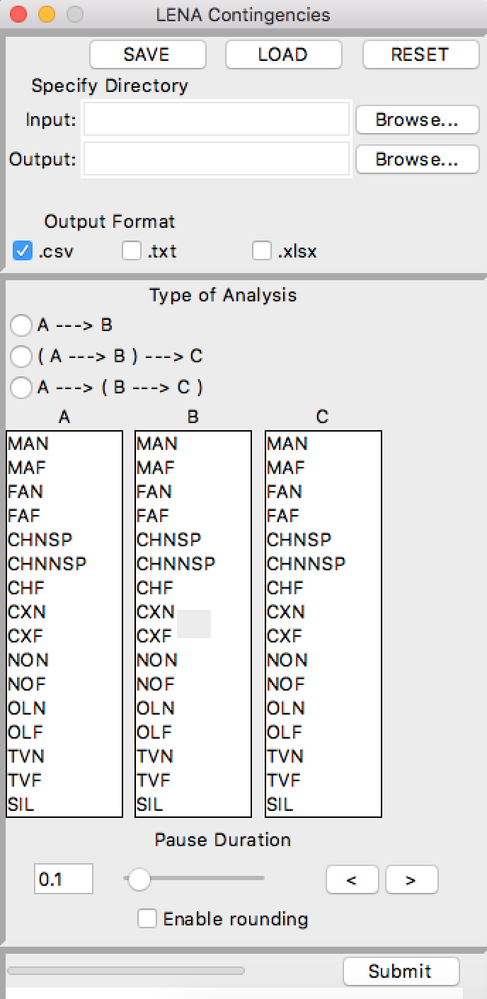

# LENA_Contingencies v3!

GUI for computing contingency tables from .its and .csv files.

## How To Run
1. Install latest build from builds directory
    The build directory contains executables for MacOS,
    Linux, and Windows operating systems!
2. Run program from desktop shortcut
3. Setup input directory(for batch of .its files)
4. Setup output directory
5. Configure Analysis
6. Press Submit!

## For Developers:
###  How To Build Program

####  Windows
  See *windows_cmds.txt* for full instructions on setting up pyinstaller and
  using the provided spec file to update the build for future developments.

####  MacOS & Unix

## Documentation & Manual
###  Doxygen
###  Manual

## License

This project is licensed under the MIT License

## Acknowledgments

* Program forked from https://github.com/kengbailey/LENA_Contingencies2
  and originally from https://github.com/HomeBankCode/LENA_contingencies
* Project completed Spring Semester 2018 @ MTSU CSCI Software Engineering
